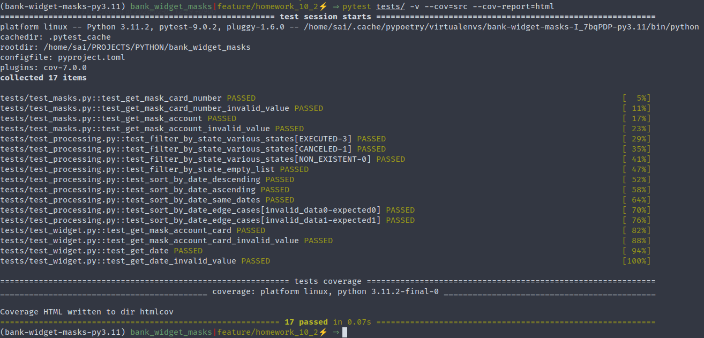
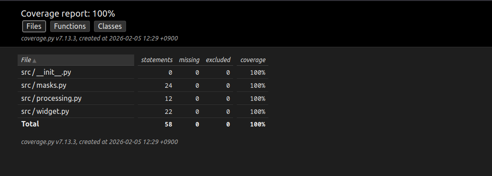

# Bank Widget Masks

Учебный проект для курса по Python. Реализует функции маскирования банковских данных и обработки операций для виджета личного кабинета пользователя банка.

---

## Цель проекта

IT-отдел банка разрабатывает новый виджет для личного кабинета клиента. Виджет отображает последние банковские операции клиента, но для обеспечения безопасности необходимо:

1. **Маскировать конфиденциальные данные** - номера карт и счетов
2. **Фильтровать операции** - по статусу выполнения
3. **Сортировать операции** - по дате для удобного отображения
4. **Форматировать даты** - в понятный для пользователя формат

Проект демонстрирует практическое применение Python для решения реальных задач финтех-индустрии с соблюдением стандартов безопасности данных (PCI DSS).

---

## Функциональность

### Модуль `masks.py` - Маскирование данных

- ✅ **Маскирование номера банковской карты** - показывает первые 6 и последние 4 цифры
- ✅ **Маскирование номера банковского счета** - показывает только последние 4 цифры

### Модуль `widget.py` - Работа с виджетом

- ✅ **Маскирование карт и счетов с названием** - обрабатывает строки типа "Visa Platinum 7000792289606361"
- ✅ **Форматирование дат** - преобразует ISO формат в читаемый вид (ДД.ММ.ГГГГ)

### Модуль `processing.py` - Обработка операций

- ✅ **Фильтрация операций по статусу** - отбор операций по состоянию (EXECUTED, CANCELED и др.)
- ✅ **Сортировка операций по дате** - упорядочивание от новых к старым или наоборот

---

## Структура проекта

```
bank-widget-masks/
│
├── src/                          # Исходный код проекта
│   ├── __init__.py               # Инициализация пакета
│   ├── masks.py                  # Функции маскирования
│   ├── widget.py                 # Функции виджета
│   └── processing.py             # Функции обработки операций
│
├── tests/                        # Тесты проекта
│   ├── __init__.py               # Инициализация пакета тестов
│
├── main.py                       # Главный файл с демонстрацией
├── poetry.lock                   # Лок-файл зависимостей.
├── pyproject.toml                # Конфигурация Poetry и зависимостей
├── .flake8                       # Конфигурация линтера
├── .gitignore                    # Игнорируемые файлы для Git
└── README.md                     # Документация проекта
```

---

## Требования

- **Python**: 3.11 или выше
- **Poetry**: для управления зависимостями

---

## Установка и настройка

### Шаг 1: Клонирование репозитория

```bash
# Клонируйте репозиторий
git clone git@github.com:ivanitch/bank-widget-masks.git
cd bank-widget-masks
```

### Шаг 2: Установка зависимостей

```bash
# Активируйте виртуальное окружение Poetry
poetry shell

# Установите все зависимости проекта
poetry install
```

После выполнения этих команд Poetry:
- Создаст виртуальное окружение
- Установит все необходимые библиотеки (pytest, flake8, black, isort, mypy)
- Подготовит проект к работе

---

## Описание функций

### Модуль `masks.py`

#### `get_mask_card_number(card_number: str) -> str`

Маскирует номер банковской карты, оставляя видимыми первые 6 и последние 4 цифры.

**Параметры:**
- `card_number` (str) - номер карты (16 цифр)

**Возвращает:**
- `str` - замаскированный номер в формате `XXXX XX** **** XXXX`

**Пример:**
```python
from src.masks import get_mask_card_number

card = "7000792289606361"
masked = get_mask_card_number(card)
print(masked)  # Вывод: 7000 79** **** 6361
```

---

#### `get_mask_account(account_number: str) -> str`

Маскирует номер банковского счета, оставляя видимыми только последние 4 цифры.

**Параметры:**
- `account_number` (str) - номер счета (обычно 20 цифр)

**Возвращает:**
- `str` - замаскированный номер в формате `**XXXX`

**Пример:**
```python
from src.masks import get_mask_account

account = "73654108430135874305"
masked = get_mask_account(account)
print(masked)  # Вывод: **4305
```

---

### Модуль `widget.py`

#### `mask_account_card(card_or_account: str) -> str`

Универсальная функция для маскирования карт и счетов вместе с их названием.

**Параметры:**
- `card_or_account` (str) - строка с названием и номером карты/счета

**Возвращает:**
- `str` - замаскированные данные с сохранением названия

**Примеры:**
```python
from src.widget import mask_account_card

# Маскирование карты
card = "Visa Platinum 7000792289606361"
print(mask_account_card(card))
# Вывод: Visa Platinum 7000 79** **** 6361

# Маскирование счета
account = "Счет 73654108430135874305"
print(mask_account_card(account))
# Вывод: Счет **4305
```

---

#### `get_date(date_string: str) -> str`

Преобразует дату из ISO 8601 формата в формат ДД.ММ.ГГГГ.

**Параметры:**
- `date_string` (str) - дата в ISO формате (например: `2024-03-11T02:26:18.671407`)

**Возвращает:**
- `str` - дата в формате `ДД.ММ.ГГГГ`

**Пример:**
```python
from src.widget import get_date

date_iso = "2024-03-11T02:26:18.671407"
formatted = get_date(date_iso)
print(formatted)  # Вывод: 11.03.2024
```

---

### Модуль `processing.py`

#### `filter_by_state(data: list[dict], state: str = "EXECUTED") -> list[dict]`

Фильтрует список операций по статусу выполнения.

**Параметры:**
- `data` (list[dict]) - список словарей с операциями
- `state` (str) - статус для фильтрации (по умолчанию `'EXECUTED'`)

**Возвращает:**
- `list[dict]` - отфильтрованный список операций

**Пример:**
```python
from src.processing import filter_by_state

operations = [
    {'id': 414288290, 'state': 'EXECUTED', 'date': '2019-07-03T18:35:29'},
    {'id': 594226727, 'state': 'CANCELED', 'date': '2018-09-12T21:27:25'},
    {'id': 939719570, 'state': 'EXECUTED', 'date': '2018-06-30T02:08:58'}
]

# Получить только выполненные операции
executed = filter_by_state(operations, state='EXECUTED')
print(f"Выполненных операций: {len(executed)}")  # Вывод: 2

# Получить отмененные операции
canceled = filter_by_state(operations, state='CANCELED')
print(f"Отмененных операций: {len(canceled)}")  # Вывод: 1
```

---

#### `sort_by_date(data: list[dict], reverse: bool = True) -> list[dict]`

Сортирует список операций по дате.

**Параметры:**
- `data` (list[dict]) - список словарей с операциями
- `reverse` (bool) - порядок сортировки:
  - `True` (по умолчанию) - от новых к старым
  - `False` - от старых к новым

**Возвращает:**
- `list[dict]` - отсортированный список операций

**Пример:**
```python
from src.processing import sort_by_date

operations = [
    {'id': 414288290, 'state': 'EXECUTED', 'date': '2019-07-03T18:35:29'},
    {'id': 939719570, 'state': 'EXECUTED', 'date': '2018-06-30T02:08:58'},
    {'id': 615064591, 'state': 'CANCELED', 'date': '2018-10-14T08:21:33'}
]

# Сортировка от новых к старым (по умолчанию)
sorted_desc = sort_by_date(operations)
print(sorted_desc[0]['date'][:10])  # Вывод: 2019-07-03

# Сортировка от старых к новым
sorted_asc = sort_by_date(operations, reverse=False)
print(sorted_asc[0]['date'][:10])  # Вывод: 2018-06-30
```

---

## Запуск проекта

### Демонстрация всех функций

```bash
python main.py
```

Эта команда запустит демонстрацию работы всех модулей:
- Маскирование карт и счетов
- Форматирование дат
- Фильтрация операций
- Сортировка операций
- Комбинированное использование функций
- Статистика операций

**Пример вывода:**
```
======================================================================
ДЕМОНСТРАЦИЯ МОДУЛЯ WIDGET
======================================================================
Исходная карта: Visa Platinum 7000792289606361
Замаскированная карта: Visa Platinum 7000 79** **** 6361

Исходный счет: Счет 73654108430135874305
Замаскированный счет: Счет **4305

Дата ISO: 2026-01-21T02:26:18.671407
Дата отформатирована: 21.01.2026

======================================================================
ДЕМОНСТРАЦИЯ МОДУЛЯ PROCESSING
======================================================================
Фильтрация операций по статусу
----------------------------------------------------------------------
Всего операций: 5
Выполненных операций (EXECUTED): 3
Список выполненных операций:
  • ID: 414288290, Дата: 03.07.2019, Статус: EXECUTED
  • ID: 939719570, Дата: 30.06.2018, Статус: EXECUTED
  • ID: 142264268, Дата: 04.04.2019, Статус: EXECUTED
Сортировка по возрастанию (от старых к новым):
  • Дата: 30.06.2018, ID: 939719570, Статус: EXECUTED
  • Дата: 12.09.2018, ID: 594226727, Статус: CANCELED
  • Дата: 14.10.2018, ID: 615064591, Статус: CANCELED
  • Дата: 04.04.2019, ID: 142264268, Статус: EXECUTED
  • Дата: 03.07.2019, ID: 414288290, Статус: EXECUTED
...
```

## Тестирование

```bash
# Запуск всех тестов
pytest tests/

# Запуск всех тестов с подробным выводом
pytest tests/ -v

# Запуск с покрытием кода
pytest tests/ -v --cov=src --cov-report=html

# Запуск конкретного тестового файла
pytest tests/test_masks.py
pytest tests/test_widget.py
pytest tests/test_processing.py
```





---

## Проверка качества кода

### Линтинг (Flake8)

Проверка соответствия коду стандарту PEP 8:

```bash
flake8 src/ tests/

#flake8 main.py
#flake8 src/
#flake8 main.py src/
```

### Форматирование (Black)

Автоматическое форматирование кода:

```bash
# Форматирование файлов проекта и тестов
black src/ tests/

# Проверка без изменений
black --check src/ tests/

# Примеры
#black main.py
#black src/
#black main.py src/
```

### Сортировка импортов (isort)

Упорядочивание импортов:

```bash
# Сортировка импортов в проекте и в тестах
isort src/ tests/

# Проверка без изменений
isort --check-only src/ tests/

# Сортировка импортов
isort main.py
isort src/
isort main.py src/
```

### Проверка типов (mypy)

Статическая проверка типов:

```bash
mypy main.py src/
```

### Запуск всех проверок одной командой

```bash
flake8 src/ tests/ && \
black src/ tests/ && \
isort src/ tests/ && \
mypy src/ tests/
```

Или можно запустить скрипт:
```bash
./lint.sh
```

## Примеры использования

### Пример 1: Базовое маскирование

```python
from src.masks import get_mask_card_number, get_mask_account

# Маскирование карты
card = "4532015112830366"
print(get_mask_card_number(card))  # 4532 01** **** 0366

# Маскирование счета
account = "12345678901234567890"
print(get_mask_account(account))  # **7890
```

### Пример 2: Работа с виджетом

```python
from src.widget import mask_account_card, get_date

# Универсальное маскирование
print(mask_account_card("MasterCard 5425233430109903"))
# MasterCard 5425 23** **** 9903

# Форматирование даты
print(get_date("2024-12-25T15:30:00.000000"))
# 25.12.2024
```

### Пример 3: Обработка операций

```python
from src.processing import filter_by_state, sort_by_date

operations = [
    {'id': 1, 'state': 'EXECUTED', 'date': '2024-01-15T10:00:00'},
    {'id': 2, 'state': 'CANCELED', 'date': '2024-01-10T09:00:00'},
    {'id': 3, 'state': 'EXECUTED', 'date': '2024-01-20T14:00:00'}
]

# Получить последние 5 выполненных операций
result = sort_by_date(
    filter_by_state(operations, 'EXECUTED'),
    reverse=True
)[:5]

print(f"Найдено операций: {len(result)}")
for op in result:
    print(f"  ID: {op['id']}, Дата: {op['date'][:10]}")
```

### Пример 4: Полный цикл обработки

```python
from src.widget import mask_account_card, get_date
from src.processing import filter_by_state, sort_by_date

def display_recent_operations(operations, n=5):
    """Показать последние N выполненных операций."""
    # Фильтруем выполненные
    executed = filter_by_state(operations, 'EXECUTED')

    # Сортируем от новых к старым
    sorted_ops = sort_by_date(executed, reverse=True)

    # Берем первые N
    recent = sorted_ops[:n]

    # Выводим с форматированием
    print(f"\nПоследние {len(recent)} операций:")
    for i, op in enumerate(recent, 1):
        date = get_date(op['date'])
        card = mask_account_card(op.get('description', 'N/A'))
        print(f"{i}. {date} - {card}")

# Использование
all_operations = [...]  # ваши данные
display_recent_operations(all_operations, n=10)
```

## Полезные ссылки

- [Документация Python](https://docs.python.org/3/)
- [Poetry Documentation](https://python-poetry.org/docs/)
- [PEP 8 Style Guide](https://pep8.org/)
- [pytest Documentation](https://docs.pytest.org/)
- [PCI DSS Requirements](https://www.pcisecuritystandards.org/)
- [Python Testing with pytest (Brian Okken)](https://tisten.ir/blog/wp-content/uploads/2019/01/Python-Testing-with-pytest-Pragmatic-Bookshelf-2017-Brian-Okken.pdf)
- [Pytest-Cheatsheet](https://github.com/mananrg/Pytest-Cheatsheet)
- [Раздел про тестирование в Hitchhiker's Guide to Python](https://docs.python-guide.org/writing/tests/)

---

*Этот проект создан с ❤️ для изучения Python и best practices разработки*
